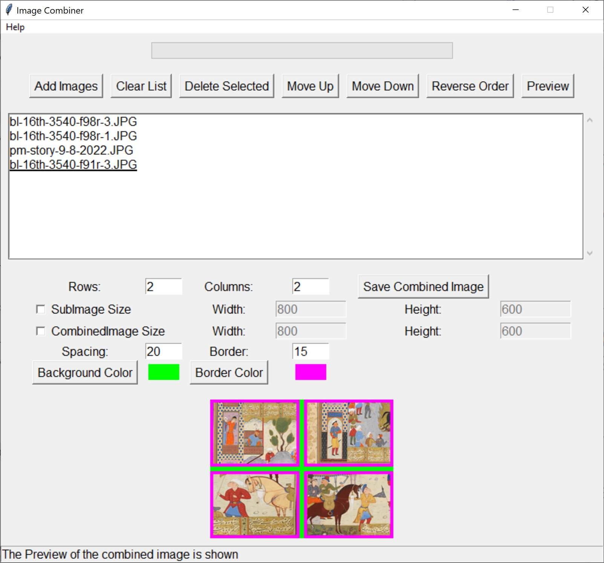

# ImageCombiner
### First release, version 0.0.0.0
1) Select one, two, or more images first.
2) Choose the rows and columns of the grid to embed the images.
3) You can change the order of the images in the listbox, or add or remove images.
4) You can choose to have border and/or spacing with user-selected colors.
5) You also can define the size of the final combined image if you would like.
6) Finally, by pressing the **Save Combined Image** you save the final grid of images.

**Hint:** This application is completely free. 
## This archive includes the executable program, **ImageCombiner.exe**, which you should click on to run.
[Download the archive for win64 (Windows 10 and over)](https://drive.google.com/file/d/1E19N8v96Ghi_wBQ_EAw_8BI_vgPkgt-C/view?usp=sharing)
---
 *Figure 1: A snapshot of ImageCombiner, version 0.0.0.0, while placing the images.*
---